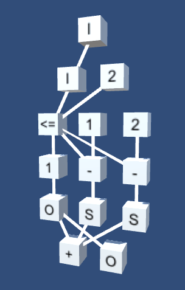

## Исследование визуального языка программирования

### Цель

Придумать язык, который позволит комфортно создавать программы в трёхмерном пространстве с помощью VR. Язык позволит красиво иллюстрировать алгоритмы. Красотой кода смогут насладиться не только программисты. Такой код можно будет тематически оформлять. Скорей всего это будет дорогое удовольствие для привлечения программистов. Это скрасит разработку и даст возможность делать красивые презентации кода.

#### Эскиз

  
граф, вычисляющий n-ое число фибоначчи по наивному методу, вершина CB (CallBack) выполняет роль рекурсии

  

### Основные принципы
1. Красота
2. Компактность
3. Минимум контекста
4. Наглядность
5. Эргономика

## Прогресс

### Шаг 1 - простые арифметические операции и ветвление

  
профайлер простого графа

  

### Шаг 2 - рекурсия через подпространство

  
профайлер числа Фибоначчи при n=4

  

### Шаг 3 - интерпретатор на питоне через регулярки

Пример:
`gi -p examples/simple.g 5`

### Шаг 4 - использование граммара

Добавлен ANTLR [граммар](./Gravis.g4). На его основе сделан парсер. Пришлось отказаться от табуляции, иначе граммар получается с кодом на языке, для которого генерируется парсер. В моём же случае, нужны разные парсеры для разных языков.

### Шаг 5 - редактор на Unity

[исходники редактора](./editor)

#### Шаг 5.1 - Отрисовка графа

Добавлен ANTLR парсер и сортировка дерева на основе уровня глубины.

  
Пример Фибоначчи

  

#### Шаг 5.2 - Работа с узлами в простом графе
#### Шаг 5.3 - Работа с подпространством
#### Шаг 5.4 - Загрузка и сохранение графа

### Шаг ? - интерпретатор на Си

## Идеи

1. Ввести понятие - подпространство. Это изолированная область от внешних и внутренних контекстов. У подпространства есть входные связи и выходные. Такой механизм позволит сделать рекурсию через генератор подпрастранства.
2. Работу со списками можно сделать через хвостовую рекурсию. Здесь понадобятся ноды получения первого и оставшихся элементов в последовательности.
