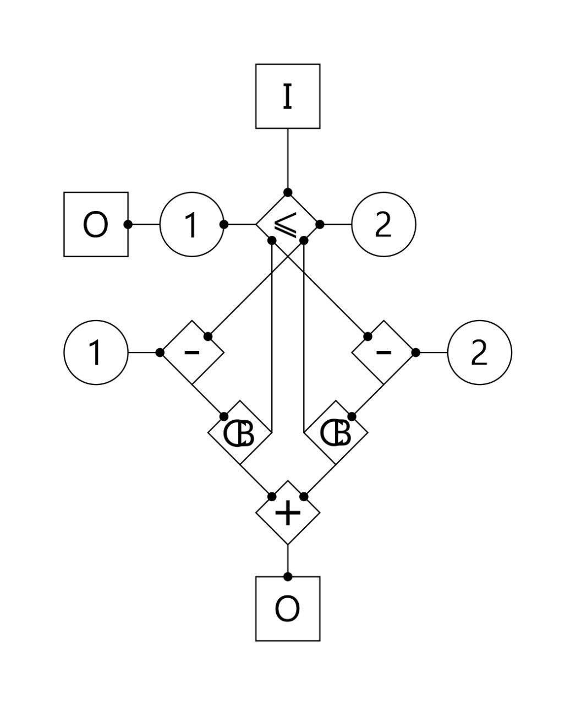

## Исследование визуального языка программирования

### Цель

Придумать язык, который позволит комфортно создавать программы в трёхмерном пространстве с помощью VR. Язык позволит красиво иллюстрировать алгоритмы. Красотой кода смогут насладиться не только программисты. Такой код можно будет тематически оформлять. Скорей всего это будет дорогое удовольствие для привлечения программистов. Это скрасит разработку и даст возможность делать красивые презентации кода.

#### Эскиз

граф, вычисляющий n-ое число фибоначчи по наивному методу, вершина CB (CallBack) выполняет роль рекурсии

### Основные принципы
1. Красота
2. Компактность
3. Минимум контекста
4. Наглядность
5. Эргономика

## Прогресс

### Шаг 1 - простые арифметические операции и ветвление

профайлер простого графа

### Шаг 2 - рекурсия через подпространство

профайлер числа Фибоначчи при n=4

### Шаг 3 - интерпретатор

Пример:
`gi examples/simple.g 5`

## Идеи

1. Ввести понятие - подпространство. Это изолированная область от внешних и внутренних контекстов. У подпространства есть входные связи и выходные. Такой механизм позволит сделать рекурсию через генератор подпрастранства.
